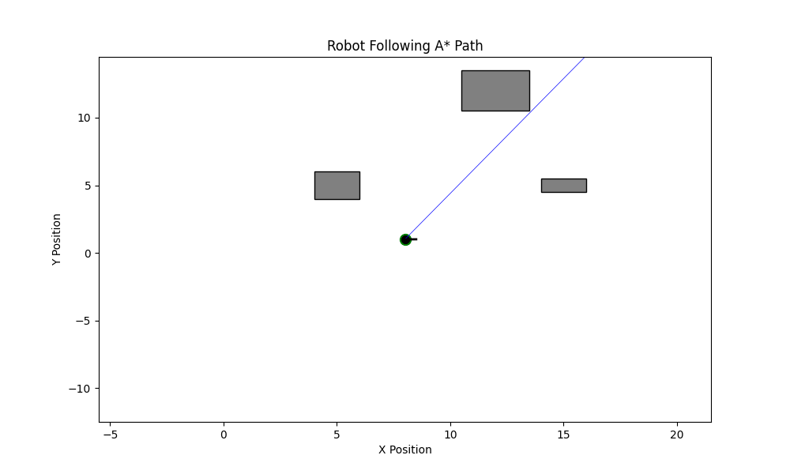
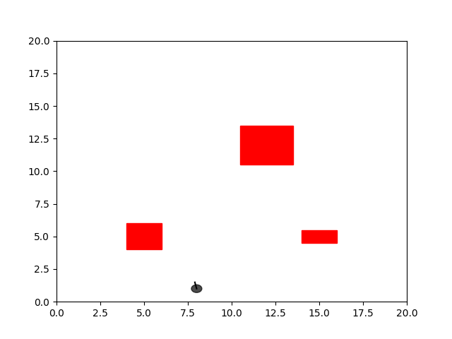
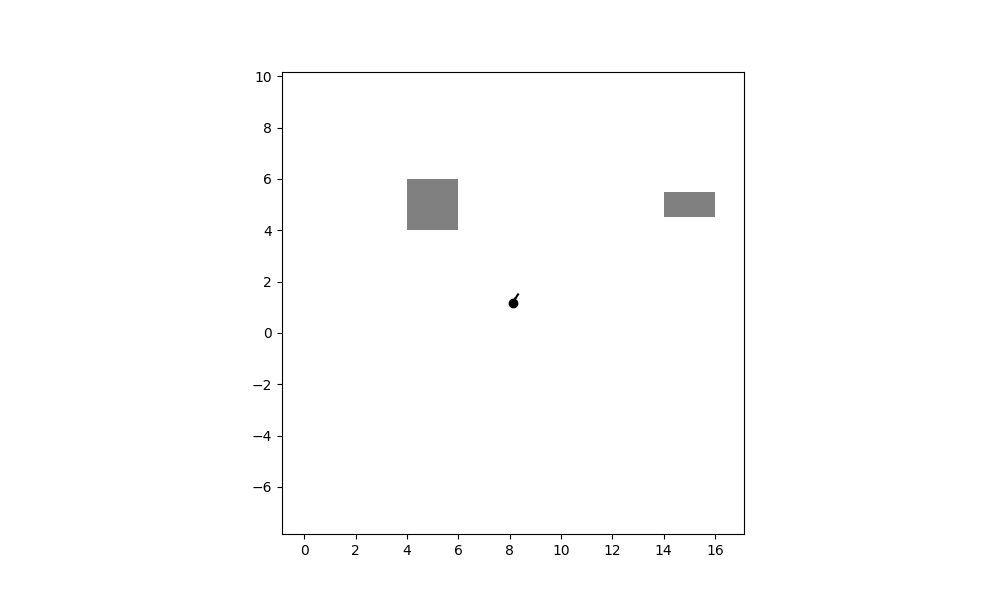
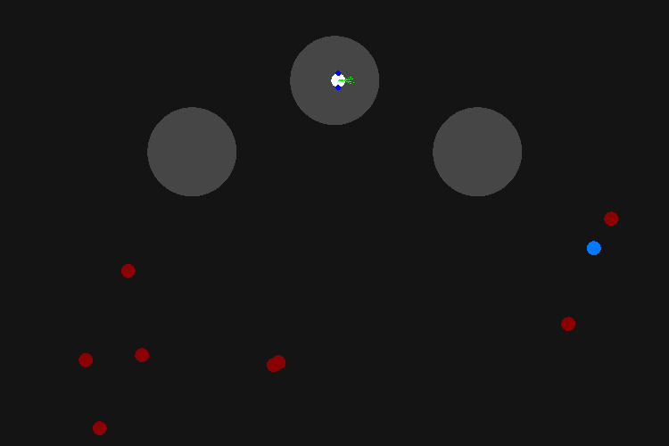

# From Mapping to Motion: An Integrated Approach to Autonomous Path Planning

Comprehensive implementation of autonomous robot navigation algorithms from SLAM to local planning, featuring multiple path planning approaches, behavior tree control, and GPU acceleration.

## Project Overview

This repository demonstrates a complete autonomous navigation pipeline:

1. **Mapping & Localization** (SLAM via Behavior Trees)
2. **Global Path Planning** (A*, Dijkstra, RRT*)
3. **Local Planning** (Dynamic Window Approach with CUDA)
4. **Reactive Control** (Artificial Potential Fields)
5. **Behavior Coordination** (py_trees Behavior Trees)

## Repository Structure

```
autonomous-path-planning/
│
├── python_algorithms/          # Global path planning implementations
│   ├── src/                    # Modular Python code (A*, Dijkstra, RRT*, APF)
│   ├── configs/                # YAML configuration files
│   ├── outputs/                # Algorithm demonstrations (GIFs)
│   └── README.md
│
├── python_dwa/                 # Python Dynamic Window Approach
│   ├── configs/                # DWA parameters
│   ├── outputs/                # Simulation GIF
│   └── README.md
│
├── cuda_dwa/                   # GPU-Accelerated DWA (30-50x speedup)
│   ├── src/                    # CUDA and C++ implementations
│   ├── include/                # Header files
│   ├── configs/                # YAML parameters
│   ├── outputs/                # Demo video
│   ├── Makefile
│   └── README.md
│
├── webots_simulation/          # Webots behavior tree controller
│   ├── controllers/            # BT-based SLAM + navigation
│   │   └── bt_mapping_navigation/
│   ├── worlds/                 # Webots world files
│   ├── outputs/                # Simulation video
│   └── README.md
│
├── README.md                   # This file
└── .gitignore
```

## Quick Start

### 1. Python Path Planning Algorithms

```bash
cd python_algorithms

# Install dependencies
python3 -m venv venv
source venv/bin/activate
pip install -r requirements.txt

# Run A* algorithm
python src/main.py --algorithm astar

# Run with visualization and save output
python src/main.py --algorithm rrt_star --save
```

### 2. Webots SLAM Simulation

```bash
# Install Webots: https://cyberbotics.com/
# Open world file
webots webots_simulation/worlds/KitchenBehaviorTree.wbt

# Controller automatically runs BT_mapping_navigation
```

### 3. CUDA DWA (GPU Acceleration)

```bash
cd cuda_dwa

# Check dependencies
make check-deps

# Install dependencies (Ubuntu/Debian)
sudo apt-get install nvidia-cuda-toolkit libyaml-cpp-dev

# Build both CPU and GPU versions
make all

# Run performance benchmark
make benchmark
```

## Results and Discussion

This section presents the visual outputs from each implemented algorithm, demonstrating their effectiveness in different navigation scenarios.

### Global Path Planning Algorithms

#### A* Algorithm
The A* algorithm finds optimal paths using heuristic-guided search with guaranteed optimality.



*A* algorithm with CSC trajectory smoothing navigating around obstacles.*

#### Dijkstra's Algorithm
Dijkstra's algorithm computes shortest paths without heuristics, exploring nodes uniformly.


*Dijkstra's algorithm finding shortest path in the environment.*

#### RRT* Algorithm
RRT* (Rapidly-exploring Random Tree Star) builds a tree of collision-free trajectories with asymptotic optimality through rewiring.


*RRT* tree growth with rewiring optimization.*



*Robot following the RRT* planned path.*

#### Artificial Potential Fields (APF)
APF uses attractive and repulsive forces for reactive navigation in dynamic environments.



*APF reactive navigation with real-time obstacle avoidance.*

### Local Planning: Dynamic Window Approach

#### Python DWA
Real-time trajectory optimization using the Dynamic Window Approach for differential drive robots.



*DWA local planner with differential drive kinematics.*

### System Integration

#### Webots SLAM Simulation
Complete autonomous navigation pipeline with Behavior Trees combining LiDAR mapping, A* planning, and waypoint navigation.

**Video**: [Webots SLAM Simulation](webots_simulation/outputs/webots_simulation.mp4)

#### CUDA Acceleration
GPU-accelerated DWA implementation demonstrating 30-50x speedup over CPU baseline.

**Demo Video**: [Mobile App with CUDA DWA](cuda_dwa/outputs/mobileapp.mp4)

## Algorithms Implemented

### Global Path Planning

| Algorithm | Type | Optimal | Best For |
|-----------|------|---------|----------|
| **A*** | Graph-based | ✅ Yes | Known maps, guaranteed optimality |
| **Dijkstra** | Graph-based | ✅ Yes | Shortest path without heuristic |
| **RRT*** | Sampling-based | ✅ Asymptotic | High-dimensional spaces |
| **APF** | Reactive | ❌ No | Real-time, dynamic environments |

### Local Planning

| Algorithm | Implementation | Performance | Use Case |
|-----------|---------------|-------------|----------|
| **DWA (Python)** | Sequential CPU | ~300-500ms | Development, debugging |
| **DWA (CUDA)** | Parallel GPU | ~5-10ms | Real-time control (30-50x faster) |

### System Integration

- **Behavior Trees** (py_trees): Hierarchical control architecture
- **SLAM**: LiDAR-based occupancy grid mapping
- **Navigation**: PD control for waypoint following

## Features

- ✅ **Modular Architecture**: Clean separation of concerns
- ✅ **YAML Configuration**: All parameters configurable without recompilation
- ✅ **Comprehensive Documentation**: Extensive comments and docstrings
- ✅ **Visualization**: Built-in matplotlib/pygame visualization
- ✅ **Performance Benchmarks**: CPU vs GPU comparisons
- ✅ **Demo Outputs**: GIFs and videos for all algorithms

## Performance Highlights

### CUDA DWA Performance

| Metric | CPU (C++) | GPU (CUDA) | Speedup |
|--------|-----------|------------|---------|
| Time (10K trajectories) | 300-500ms | 5-10ms | **30-50x** |
| Throughput | ~25K traj/sec | ~1M traj/sec | **40x** |

### Path Planning Performance

Typical performance on 20x20 map with 3 obstacles:

| Algorithm | Path Length | Planning Time | Nodes Explored |
|-----------|-------------|---------------|----------------|
| A* | ~24.5 units | ~0.002s | ~15 nodes |
| Dijkstra | ~24.5 units | ~0.003s | ~25 nodes |
| RRT* | ~26.0 units | ~0.050s | 500 samples |
| APF | ~25.0 units | ~0.100s | ~800 steps |

## Dependencies

### Python Dependencies
```bash
pip install numpy scipy matplotlib PyYAML Pillow py_trees pygame
```

### System Dependencies
```bash
# Webots (for simulation)
# Download from: https://cyberbotics.com/

# CUDA Toolkit (for GPU acceleration)
sudo apt-get install nvidia-cuda-toolkit

# yaml-cpp (for C++ config loading)
sudo apt-get install libyaml-cpp-dev
```

## Configuration

All implementations support YAML-based configuration:

```yaml
# Example: python_algorithms/configs/astar.yaml
algorithm:
  heuristic: euclidean
  trajectory_smoothing: true

output:
  save_animation: true
  plot_filename: astar_result.png
```

Benefits:
- No recompilation for parameter changes
- Easy experimentation with different settings
- Version control friendly
- Multiple configuration profiles (testing, deployment)

## Project Highlights

### 1. Behavior Tree Architecture
- Modular SLAM + navigation pipeline
- Parallel mapping and exploration
- Map persistence across runs
- py_trees integration

### 2. CUDA Parallelization
- 10,240 trajectories evaluated simultaneously
- Shared memory parallel reduction
- 30-50x speedup over CPU baseline
- Real-time capable (100+ Hz)

### 3. Comprehensive Path Planning Suite
- Four different global planning algorithms
- Comparative performance analysis
- Trajectory smoothing with cubic splines
- Collision-free navigation

## Documentation

- **Per-directory READMEs**: Specific documentation for each module
- **Inline comments**: Comprehensive code documentation
- **YAML configs**: Self-documenting parameter files

## Contributing

This project demonstrates:
- Clean code organization
- Modular design patterns
- Performance optimization techniques
- Real-time robotics algorithms
- GPU acceleration for robotics

## Output Demos

All algorithms include visual demonstrations:

- `python_algorithms/outputs/`: GIFs for A*, Dijkstra, RRT*, APF
- `cuda_dwa/outputs/`: Mobile app demo video
- `webots_simulation/outputs/`: Behavior tree simulation video
- `python_dwa/outputs/`: DWA simulation GIF

## Authors

This project was developed with equal contributions from:

- **Baraa Lazkani** - [BaraaLazkani](https://github.com/BaraaLazkani)
- **Modar Ibrahim**
- **Laith Alsheikh**

All three authors contributed equally to the research, implementation, and documentation of this work.

## License

This project is licensed under a custom non-commercial license. Key points:

- **Non-Commercial Use**: Free to use for academic research and non-commercial purposes
- **Commercial Use**: Requires written approval from all three authors
- **Citation Required**: All uses must cite this repository (see Citation section below)

See the [LICENSE](LICENSE) file for complete terms and conditions.

## Acknowledgments

- **py_trees**: Behavior tree library
- **Webots**: Robot simulation platform
- **CUDA**: GPU computing platform
- **yaml-cpp**: YAML parser for C++

## Citation

**Required**: If you use this work in any capacity, you must cite this repository:

```bibtex
@misc{lazkani2024autonomous,
  title={From Mapping to Motion: An Integrated Approach to Autonomous Path Planning},
  author={Lazkani, Baraa and Ibrahim, Modar and Alsheikh, Laith},
  year={2024},
  publisher={GitHub},
  url={https://github.com/BaraaLazkani/From_Mapping_to_Motion_An_Integrated_Approach_to_Autonomous_Path_Planning},
  note={Comprehensive implementation of path planning algorithms with GPU acceleration. All authors contributed equally.}
}
```

## Contact

- **General Questions**: Open an issue on GitHub
- **Commercial Use Inquiries**: Contact all authors for approval
  - Baraa Lazkani: lazkani.baraa.official@gmail.com
- **Contributions**: Pull requests are welcome

---

**Keywords**: Path Planning, SLAM, Behavior Trees, CUDA, GPU Acceleration, A*, RRT*, DWA, Autonomous Navigation, Mobile Robotics
